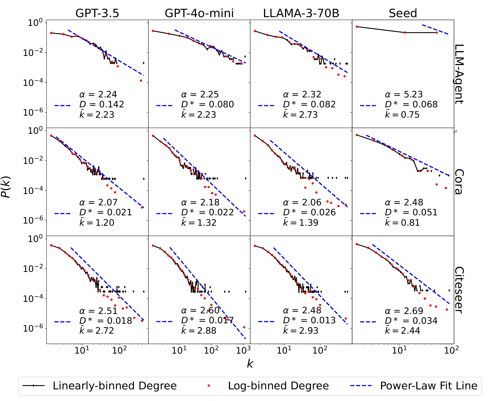

# CiteAgent 

Traditional social science research (SSR) faces several limitations, including restricted experimentation and limited applicability across diverse contexts. Experiments are often confined to tightly controlled lab environments or lack comprehensive environmental control in real-world settings, restricting the ability to gain nuanced insights into the causal mechanisms underlying human behaviors.

To address these challenges, we introduce a novel LLM-agent-based simulation platform, the CiteAgent framework, designed to simulate academic behavior with a focus on modeling the formation and evolution of citation networks. CiteAgent offers the following advantages:
(1) Realistic Citation Network Modeling: Captures real-world phenomena in citation dynamics, such as power-law distribution and citation patterns, providing insights into complex academic interactions.
(2) Controlled Experimental Environment: Allows researchers to systematically adjust academic environments, enabling detailed investigation of factors influencing academic and social behaviors.
(3) Scalable Simulations for Social Science Research: Supports extensive and reproducible simulations that facilitate hypothesis testing and validation, expanding the methodological toolkit for SSR beyond traditional approaches. 


<p align="center"><em>Figure 1: CiteAgent Framework Workflow</em></p>

## 🛠️ Setup
Before we get started, please configure your OpenAI API keys in the file located at LLMGraph\llms\default_model_configs.json. The format should be as follows:
```json
 {
        "model_type": "openai_chat",
        "config_name": "gpt-3.5-turbo-0125",
        "model_name": "gpt-3.5-turbo-0125",
        "api_key": "sk-.*",
        "generate_args": {
            "max_tokens": 2000,
            "temperature": 0.8
        },
        "client_args":{
            "base_url":""
        }
    }
```

Next, create the experiment and install the necessary packages by running:
    ```
    pip install -i "requirements.txt"
    ```

## 📦 Usage
We offer three seed networks enriched with text features for author and paper: Cora, Citeseer, and LLM_Agent.

To begin constructing a citation graph, please specify the `task_name` and `config_name`:

- **config_name**: Control the academic environment setup in CiteAgent"
- **task_name**: Choose from "cora", "citeseer", or "llm_agent_*" (where you specify the corresponding seed network).

Then, execute the following commands:

```bash
# Build the citation graph using the Cora dataset
python main.py --task cora --config "test_config" --build 

# Build the citation graph using the Citeseer dataset
python main.py --task citeseer --config "test_config" --build 

# Build the citation graph using the LLM_Agent dataset
python main.py --task llm_agent_1 --config "test_config" --build 
```

Make sure to adjust the `task_name` according to the seed network you wish to use.

### Template Configuration
To customize the simulation, adjust the configuration file found at `LLMGraph\tasks\llm_agent_1\configs\template_*`. 

We offer support for multiple scholarly search engines, including Generated Papers, Arxiv, and Google Scholar. Change the `online_retriever_kwargs` field to specify the search engine you wish to use.

## 🧪 Experiments

For the experiments outlined in the paper, we provide a script for execution.


- **Run Simulation Experiments**:
    start launchers first
    ```bash
    python start.py --start_server
    ```
    then run simulation experiments
    ```bash
    python start.py 
    ```

- **Run Evaluation Metrics for Simulation Experiments**:
    ```bash
    python evaluate.py
    ```

- **Visualize Experimental Results**:
    Please refer to `evaluate/Graph/readme.md` for detailed instructions.


## ✅ Results
The CiteAgent paper simulates key phenomena in citation networks, including **power-law distribution** and **citational distortion**. To analyze the mechanisms underlying these observed phenomena, we propose two LLM-based SSR research paradigms for examining human referencing behavior: **LLM-SA** (Synthetic Analysis) and **LLM-CA** (Counterfactual Analysis). Additional simulations and analyses of other phenomena are provided in the paper.

### Power Law Distribution

The degree distribution of citation networks often follows a power-law distribution[1], reflecting a scale-free characteristic. Citation networks generated by the CiteAgent framework replicate this property, exhibiting realistic scale-free behavior that closely mirrors real-world citation dynamics.

<p align="center"><em>Figure 2: Power Law Distribution</em></p>

### Citational Distortion
This phenomenon, which captures biases in citation practices[2], is effectively simulated within the CiteAgent framework. Through interactions among LLM-based agents, CiteAgent reproduces this distortion phenomena.

<p align="center"><em>Figure 3: Citational Distortion</em></p>


<!-- ## Citation -->


## References
1. Barabási A L, Albert R. Emergence of scaling in random networks[J]. science, 1999, 286(5439): 509-512.
2. Gomez C J, Herman A C, Parigi P. Leading countries in global science increasingly receive more citations than other countries doing similar research[J]. Nature Human Behaviour, 2022, 6(7): 919-929.